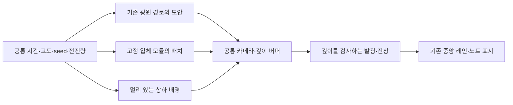

# 건축 모듈 통합·최적화·열린 상하 배경 구상

2026-09-10. **8종 개별 시연과 기존 절단면 광원 속 A~H 선택 비교를 구현했다.** E 하나의 통합에 이어8종을 같은 고도·거리에서 바꿔보는 기능을 추가했다. E의 주변 원경·뒤 골조·하부 연결에 이어, 나머지7종도 원본 고정부에서 y=−640까지 이어지는 구조 연장을 추가했다. `구조 연장`은 A~H 공통 선택이며 E의 입체 주변 건축은 별도로 유지한다. 다수 건물 최적화·본편 통합은 아직 설계 단계다. 원래 시연의 기본 화면과 RFD 0025, 본 게임의 규칙은 유지한다. 구현 검증은 [8종 시연 기록](../../output/prototypes/module-fleet-20260910/NOTES.md), [E+광원 통합 비교 기록](../../output/prototypes/breakthrough-hangar-integration-20260910/NOTES.md)에 둔다. 미술 검수는 사용자가 하며, 제품 상태·최종 연출의 미정 사항 추적은 [PRD §12](../prd.md#12-미정-사항)를 따른다.

## 1. 지켜야 할 시각적 결과

- 가까운 대형 건물은 화면 한쪽을 크게 채울 수 있다. 성능 때문에 대형을 원거리에만 배치하지 않는다.
- 낮은 고도에서는 가까운 측면·돌출부 밑면·주변시의 빠른 이동을, 높은 고도에서는 아래로 지나가는 지붕·넓어진 전방 여백을 읽는다. 고도 변경으로 ID·종류·배색을 재추첨하지 않는다.
- 모듈의 입체·표면 그림을 유지하며 거리별 이미지 교체로 돌아가지 않는다. 열린 코너·중정·분기 사이의 빈 공간을 남긴다.
- 기존 직선 광원, 팔레트의 Primary/Secondary 빈도, 일부 윤곽선과 짧은 잔상을 보존한다. 기존 선호값인 크기 10%·속도 1000%·직선은 통합 비교의 출발점이다. 이 1000%의 세계 속도는 새 단독 시연과 현재 다르므로 숫자만 복사하지 않는다.
- 건축물·빛·배경의 비용을 조절하더라도 중앙 4레인과 노트 시간·입력·판정의 기준은 바꾸지 않는다. 배경 장애물의 시각적 근접을 새 충돌·실패 규칙으로 해석하지 않는다.

## 2. 현재 코드에서 확인한 비용

E 격납고는 한 번 생성한 건물을 계속 재사용한다. 풀링이 줄이는 생성·폐기 비용을 이미 피하는 단독 사례다. 다만 E는 면·부품 메시 159개와 별도 윤곽선 객체 138개를 만든다. 일부 상자는 면별 재질 6개를 쓰므로 메시 개수와 그리기 호출 수는 같지 않다. 이 수치는 코드의 구성 개수이며 실제 FPS나 병목 측정 결과가 아니다.

공통 뷰어의 고도 65%·각도 24°·크기 100% 둘러보기에서 `renderer.info`로 아래 호출 수를 관찰했다. 한 건물씩 표시한 결과이며 합산 FPS 예측에 사용하지 않는다. 검사 원본 (`../../output/prototypes/module-fleet-20260910/browser-check.json`, 로컬 보관).

| 모듈 | 면·부품 메시 | 그리기 호출 | 삼각형 |
| --- | ---: | ---: | ---: |
| A | 49 | 130 | 1,748 |
| B | 49 | 126 | 1,740 |
| C | 58 | 149 | 2,884 |
| D | 54 | 123 | 3,988 |
| E | 159 | 422 | 6,292 |
| F | 93 | 230 | 5,616 |
| G | 88 | 215 | 3,476 |
| H | 85 | 244 | 5,492 |

이 결과는 건물 내부 병합과 윤곽선 묶음을 먼저 검토할 근거다. 호출 수를 줄였을 때 얼마나 빨라지는지는 목표 기기에서 별도 측정해야 한다.

새 8종 시연 역시 한 번에 한 건물을 표시하는 검수 도구다. 다수 건물의 성능 결과로 해석하지 않는다. 외벽·밑면·장갑판·창문·문 5장의 텍스처는 공유한다. 대략 157만 픽셀씩이므로 RGBA8+전체 mipmap을 가정하면 약 40MiB이며, 실제 드라이버 할당·프레임 버퍼·임시 버퍼는 별도다. PNG 파일 용량과 GPU 메모리 사용량을 혼동하지 않는다.

## 3. 최적화 적용 순서

| 순서 | 할 일 | 줄이는 비용 / 검증 |
| --- | --- | --- |
| 1 | 같은 경로·같은 seed에서 건물 수를 1→8→24→48로 증가시켜 측정 | 실제 목표 PC·브라우저에서 프레임 시간 p50/p95/p99, CPU/GPU 시간, 그리기 호출·삼각형·할당량·GC 정지를 함께 기록. 수치는 시험 구간이며 지원 개수 보장이 아님 |
| 2 | 건물 안에서 함께 움직이는 부품을 재질별로 병합하고 윤곽선을 별도 묶음으로 합침 | 건물 하나의 그리기 호출을 먼저 줄임. 단순 Group이나 여러 material group을 붙이는 것만으로는 해결되지 않음. 앞뒤 가림·UV·열린 공간 픽셀 비교 |
| 3 | 같은 종류·같은 재질의 건물은 InstancedMesh로 묶고 형태가 다른 부품의 공통 재질은 BatchedMesh 후보로 비교 | 인스턴싱은 형태·표면 공유, 위치·회전·크기만 개별 변경. 윤곽선은 별도 경로가 필요하며 전체 건물을 무조건 한 호출로 그린다고 가정하지 않음 |
| 4 | 모듈 종류별로 필요한 동시 개수의 슬롯을 미리 준비하고 재사용 | 출현 순간 객체·GPU 리소스 생성과 폐기 방지. 로딩 중 텍스처 업로드·셰이더 준비도 완료. 풀은 장면 구성의 최대 동시 수+짧은 예비분으로 산정 |
| 5 | 보이지 않는 구간 제외 및 화면 점유율에 따른 세부 단계 | 멀리 있어도 화면을 크게 차지하는 대형은 유지. 작은 화면 크기에서만 난간·작은 보·내부 윤곽선을 줄이고 큰 실루엣·구멍·주요 조명은 유지 |
| 6 | 잔상·발광·배경의 픽셀 비용 조절 | 넓은 반투명 면의 중첩, 화면 해상도, 후처리 해상도를 따로 측정. 풀링과 인스턴싱으로 없어지지 않는 픽셀 비용을 관리 |

풀 슬롯은 `미사용 → 배치 → 비행 → 전체 경계가 시야와 잔상 구간을 벗어남 → 미사용`으로 순환시키는 구현을 제안한다. 반환 시 이전 잔상·위상·종류별 부가 상태를 초기화한다. 건물 중심만 화면 밖으로 나갔다고 반환하면 가까운 거대 건물이 끊기므로 전체 경계와 잔상 수명을 사용한다. 슬롯 번호와 장면 배치 ID를 분리해 재사용 순서가 디자인 추첨을 바꾸지 않게 한다. 풀 부족 시 비행 중 확장하기보다 원거리 장식부터 생략하고 근접 핵심 건물을 보존한다.

LOD는 거리 숫자만으로 정하지 않는다. 화면에서 차지하는 크기와 여유 범위(hysteresis)를 사용해 고도 조절 중 세부가 반복해서 켜지고 꺼지는 현상을 방지한다. 카메라 가까이에서 모듈 본체를 다른 도안으로 교체하지 않는다. 건축물 전체를 하나의 거대한 배치로 묶으면 개별 시야 제외가 어려워질 수 있으므로 모듈/공간 구간의 경계를 함께 측정한다.

목표 주사율이 60Hz라면 프레임 전체 예산은 약 16.7ms, 120Hz라면 약 8.3ms다. 아직 목표 하드웨어와 주사율에 대한 결과가 없으므로 특정 개수나 프레임 보장을 하지 않는다. 검증에서는 평균 FPS보다 저고도 대형 근접·고속 재사용 순간의 p99와 오디오/노트 타이밍을 함께 본다.

참고: [InstancedMesh](https://threejs.org/docs/pages/InstancedMesh.html)는 같은 geometry/material의 반복을, [BatchedMesh](https://threejs.org/docs/pages/BatchedMesh.html)는 같은 material을 가진 서로 다른 geometry의 묶음을 지원한다. [WebGLRenderer.info](https://threejs.org/docs/pages/WebGLRenderer.html#info)로 렌더 통계를 읽는다. 구체적인 효과는 이 프로젝트의 측정으로 판단한다.

## 4. 기존 오브젝트 연출과 연결하는 방법

현재 별도 시연의 `geometry.mjs`는 소실점 역할의 `A`와 가까운 단면 사이에서 광원의 좌표·길이·방향을 계산한다. `worldFaces()`가 실제 3차원 점들을 반환하고 `project()`가 화면에 투영한다. `surface-renderer.mjs`는 자체 WebGL 결과를 2D 캔버스에 합성하며 단면 순서에 따른 가림을 근사한다. 새 모듈 시연은 Three.js의 일반 원근과 깊이 버퍼를 쓴다.

따라서 캔버스를 단순히 위아래로 겹치는 방식으로 통합하지 않는 것을 제안한다. 가까운 건물 뒤에서 빛이 비치거나 두 흐름의 소실점이 갈라질 수 있기 때문이다.

1. **투영부터 일치시킨다.** 기존 `project()`는 `x = W/2 + x·f/(z+8)`, `y = principalY + (cameraHeight-y)·f/(z+8)`다. 새 카메라에 같은 focal length·principal point·카메라 높이를 적용하고 old +Z 전방 좌표를 Three.js의 −Z 전방으로 변환하는 어댑터를 만든다. Z 반사에 따른 면 winding·법선도 확인한다. 기존 점 표본을 두 렌더러에서 비교하는 검사부터 작성한다. 새 단독 시연의 55°·가로 60% 소실점은 기존 연출의 확정 기준으로 복사하지 않는다.
2. **광원의 규칙을 먼저 보존한다.** `worldFaces()`의 직선/삼각형 도안, mask, 배색, 윤곽선, 가까운 절단 규칙을 그대로 받아 공통 공간에서 렌더링한다. 기존 2D 보조 광원처럼 항상 건물 위에 덧그리지 않는다.
3. **공통 카메라와 공통 경로는 별개로 검증한다.** 기존 빛은 유한한 A에서 퍼지는 경로이며 단독 건물은 Z 직진이다. 같은 카메라만으로 두 흐름이 같아지지는 않는다. 제안은 건물의 배치 중심을 A→가까운 배치점의 경로에 연결하고, 건물 자체는 변형 없이 이동하는 방식이다. 모듈의 고정된 치수·회전과 경로의 방향을 별도 관리하고, 대형이 A 주변에서 겹치거나 모서리에서 급히 나타나는지 비교한다. 고도 변경 중 배치 ID/순서는 유지한다.
4. **전진 단위를 맞춘다.** 기존 `advanceMotion()`은 100%에서 세계 길이 28/초, A/E 시연은 약 6.04/초다. 통합의 출발점은 사용자가 조절한 기존 광원 속도이며, 건물의 세계 단위와 간격을 그에 맞춰 보정한다. 같은 `1000%` 문자열만 복사해 속도를 정하지 않는다. 노트 시간은 배경 속도와 독립이다.
5. **건물과 빛의 가림을 먼저, 잔상을 다음에 붙인다.** 불투명 건물 깊이를 기록하고 광원·잔상은 이를 검사한다. 발광/잔상 자체는 깊이를 쓰지 않는 후보부터 비교한다. 120ms의 세계 경로 기록을 기본 후보로 두고 저고도 급변·정지·풀 재사용 때 오래된 화면 잔상이 건물을 관통하거나 남지 않게 한다. 전 화면 bloom은 기본 전제로 추가하지 않는다.
6. **기존 장갑 조각은 비교 대상으로 남긴다.** 새 건물이 큰 규모의 주변시 단서를, 기존 직선 광원이 속도와 흐름을 맡도록 한다. 원래 장갑 조각·대각 지지대의 유지 여부는 한 화면에 무조건 더하기보다 기존/신규/겹침 비교로 판단한다. RFD 0025의 현재 기본안을 바꾸는 단계에서는 RFD와 관련 스펙을 먼저 갱신한다.

첫 통합 검증은 E 한 개+기존 직선 광원으로 한다. 고도 0/50/100%, 크기 10%·속도 1000%, 가까운 화면 경계·건물 뒤의 빛·정지/재생을 확인한 다음 8종과 혼합 배치로 확장한다. 통합과 최적화를 동시에 크게 바꿔 원인 추적을 어렵게 만들지 않는다.

## 5. 천장·바닥 대신 먼 위아래 공간

**위쪽은 매달린 시설의 밑면, 아래쪽은 여러 깊이의 지붕과 빈 공간**으로 구상한다. 둘은 가까운 장애물이 붙어 있어야 하는 벽이 아니라 주변 건축이 계속 이어진다는 단서다. 화면을 닫는 평면 바닥이나 천장에 전체 이미지를 늘여 붙이지 않는다.

| 영역 | 보이는 것 | 움직임과 고도 단서 |
| --- | --- | --- |
| 위쪽 원경 | 끊어진 부유 설비 군락·드문 연결교·멀리 매달린 시설의 밑면 | 가장 먼 부분은 매우 약한 시차. 군락 사이와 위에도 큰 공극을 남김. 고고도에서 전체 천장이 갑자기 가까워져 저고도보다 답답해지지 않도록 거리 유지 |
| 아래쪽 원경 | 높이가 다른 지붕층·깊은 수직 공극·적재 시설과 작은 불빛 | 고도가 높을수록 지붕 면과 층간 낙차가 읽힘. 낮을 때는 중근경 건물이 일부를 가리고 측면이 커짐 |
| 중경 | 실제 3D 모듈의 간략한 실루엣 | 층 사이의 시차와 가림을 담당. 좌우·상하·깊이를 엇갈리게 놓고 직각 반복 격자와 네 벽 터널을 피함 |
| 근경 | 새 A—H의 큰 덩어리·빈 공간·주요 조명 | 저고도 긴장감의 주요 담당. 한쪽을 크게 채우는 건물 뒤에 잠깐 열린 공간이 이어지는 리듬을 만듦 |

원경 제작 후보는 아주 먼 안개/건축 분위기 이미지와 서로 다른 깊이의 성긴 실루엣 몇 층, 중근경은 동일한 실제 모듈이다. 가까이 스칠 수 있는 건축을 원경 이미지에 고정해서 그려 두지 않는다. 한 장의 그림을 독립 속도로 여러 번 스크롤하면 소실점이 갈라질 수 있으므로 모든 층은 공통 카메라로 투영한다. 앞뒤 차이는 깊이에서 생기게 한다. 투명 실루엣 레이어를 제작할 경우 실제 alpha, 가림 순서, 넓은 투명 영역의 픽셀 비용을 검증한다.

분위기 시안 두 장을 [새 배경 이미지 기록](../../output/imagegen/open-depth-backgrounds-20260910/README.md)에 둔다. 시안에는 이해를 돕는 중근경 건축도 함께 그려져 있으므로 그대로 붙일 최종 배경 텍스처가 아니다. 상부는 열린 공극의 읽힘, 하부는 지붕과 낙차를 비교하기 위한 그림이다. 하부 시안의 먼 건축이 수평 띠처럼 모인 부분은 최종 제작 시 끊고, 중앙의 밝기와 안개 대비도 실제 레인 위에서 조정해야 한다.

후속 사용자 설명에 따라 검은 공백을 채우는 [먼 건축 배경 그림](../../output/imagegen/distant-architecture-backdrop-20260910/README.md)을 생성해 통합 시연의8종 뒤에 적용했다. 기존 입체 원경 군락은 별도 비교로 남긴다. 현재 그림은 밝기50%의 원경이며 고도에 따른 초점 이동과 재귀 확대를 적용한다. 고도별 자동 크롭 확대가 재귀 확대를 역행시키지 않도록, 고도 전체를 덮는 여백 배율을 고정한다. 같은 그림을 소실점 안쪽에4배씩 작게 이어 놓고80초마다4배 확대하는 기본값이다. 이전 고정 그림도 비교할 수 있다. 벽·천장·바닥이 실제 별도 입체 면이 된 것은 아니다.

## 6. 이후 실행 단위

1. 이번 8종의 형태·낮음/높음 검수 결과 반영.
2. **독립 비교 구현:** E+기존 광원의 공통 투영·가림·세계 잔상에 A~H 선택을 확장했다. 선택한 하나만 비행하며 E에는 외부 구조체·하부 연결의 추가 비교를 제공한다. 후속 피드백으로 건물 출발 깊이를1600까지 늘리고 먼 안개와 초기 진행을 조정했다. 광원은 기존 유한 사각뿔, 건물은 동일한 화면상 A 수렴 경로를 사용한다. 최신 근접 시점과 이전 A 상하 이동을 선택하며, 건물 토글로 같은 광원과 비교한다. 미술 검수는 사용자에게 남긴다.
3. 같은 장면으로 최적화 전 기준 측정 → 건물 내부 병합 → 반복 인스턴싱 → 종류별 풀 재사용을 하나씩 비교.
4. **부분 구현:**8종 공통의 먼 건축 배경 그림, E 전용 입체 실루엣12군락·뒤 골조·기둥 아래 연결부. 다른 모델의 연결과 다수 건물 배경은 다음 검토 범위다. 저고도 대형 근접의 품질을 먼저 보존하고 먼 세부·잔상 해상도부터 비용 조절.
5. 목표 PC에서 밀도·해상도·고도·최고 속도의 조합과 충분한 연속 재생을 검증한 뒤 본편 적용 범위 결정.

각 단계는 원래 시연과 나란히 비교할 수 있어야 한다. 2번의 개별 모델 비교와4번의 E 주변 공간을 구현했으며 다섯 단계를 모두 구현·성능 검증했다고 해석하지 않는다. 첫 비교는 같은 세계 경로·깊이 가림을 확인하는 범위이고, 8종은 개별 선택할 수 있으며 모든 모델 뒤에 배경 그림을 표시하고 E에서만 추가 입체 건축과 연결부를 비교한다. 동시 배치와 모든 모델의 연결을 완료한 것은 아니다.
