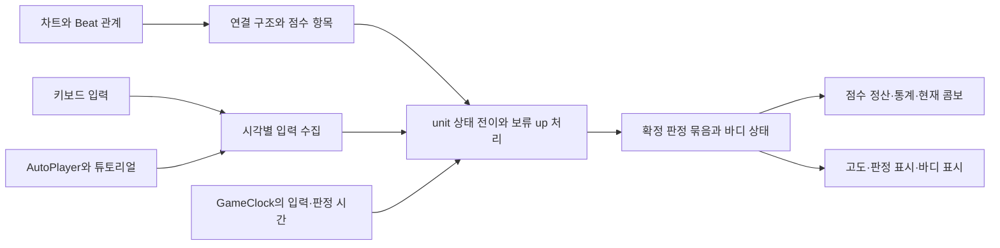

# 노트 판정 모델 구현·테스트·검증 계획

2026-09-07. 기준은 [RFD 0019](../rfd/0019-note-judgment-units-and-inheritance.md), [glossary](../context/glossary.md#롱노트-판정-모델), [38개 판정 사례](../spec/note-judgment-cases.md)이다. 이 문서는 실행 순서와 통과 기준을 정의한다. 작업 상태와 새로 발견한 제품 미결정 사항은 [PRD §12](../prd.md#12-미정-사항)에서만 관리한다.

## 1. 범위와 시작 조건

현재까지 확인한 내용에서는 구현 계획 수립을 막는 추가 제품 질문이 없다. 다음 단계는 채택 규칙을 하나의 상태 전이로 구현하고, 사례와 불변식이 함께 성립하는지 검증하는 것이다. 내부 자료구조·동률 정렬·파일 분할은 구현자가 정한다. 사용자에게 보이는 판정 결과를 선택해야 하는 최소 반례가 발견될 때만 해당 사례를 PRD에 기록하여 다시 논의한다.

이 계획은 RFD 정리 이후 승인된 구현에 적용한다. 기존 owner·이진 release·12ms 임의 이어잡기·모든 바디 끝 점수 집계·무조건적인 같은 물리 키 release 차단을 새 모델의 정답으로 가져오지 않는다. 최대 콤보수 통계는 제공하지 않으며 그 계산 정책도 검증 요구에서 제외한다.

현재 콤보, Full Combo, 고도에 대한 성공·실패 효과는 포함한다. 고도 수치 밸런싱, 새 랭킹 지표, 비행 규칙 재설계, `AutoEvent` 존폐는 이 작업에서 새로 결정하지 않는다.

### 구현 전 기준선

| 항목 | 현재 확인 결과 |
|---|---|
| 소스 기준 | `b7b6c8e` + 현재 작업 중인 설계 문서 |
| `npm test -- --reporter=dot` | 93개 파일, 1,622개 테스트 통과 |
| `npm run typecheck` | 통과 |
| 새 판정 모델 | 문서상 사례 38개. 구현 전 문서 기준 |
| lint·build·E2E | 이번 계획 작성에서는 실행하지 않음. 최종 검증 단계에 포함 |

기존 테스트 통과는 이행 전 기준선이다. 새 모델이 이미 통과했다는 의미가 아니다.

## 2. 이행 전 구현과 변경 지점

| 영역 | 이행 전 전제 | 이행할 책임 |
|---|---|---|
| [JudgmentEngine](../../src/game/judgment/JudgmentEngine.ts) | 노트 단일 상태, double의 `key1/key2`, raw held 기반 시작, 12ms 유예 | unit별 준비·활성·실패, 등록된 유지 키, 누름별 release 권한, 보류 up과 확정 판정 |
| [longNoteConnection](../../src/game/judgment/longNoteConnection.ts) | 끝·시작이 10ms 이내면 연결 | 차트상 정확히 맞닿은 관계를 한 번 계산하여 판정·렌더러가 공유 |
| [판정 상수](../../src/shared/constants/judgment.ts) | Bad 창·등급과 12ms 유예 상수 | Good까지의 매칭, 실제 release 타이밍 등급, Grace·`holdOnly` 구분 |
| [InputSystem](../../src/game/input/InputSystem.ts) | 키별 콜백을 즉시 전달 | 실제 입력 시각·키 인과관계를 보존하는 입력 수집 |
| [AutoPlayer](../../src/game/input/AutoPlayer.ts), [튜토리얼 입력](../../src/game/screens/songSelect/tutorialPreviewJudgment.ts) | press/update/release를 각자 주입 | 실입력과 같은 timestamp 묶음·기한 처리 경로 사용 |
| [ScoreManager](../../src/game/scoring/ScoreManager.ts) | 판정 하나마다 분모 3 증가 | 차트로 고정한 점수 항목·가중치, 무점수 Miss, 표시 없는 0점 정산 |
| [judgmentEffects](../../src/game/judgment/judgmentEffects.ts) | 모든 판정에 점수 기록, 바디 raw 타이밍 생략 | 점수·통계·콤보·고도·표시의 효과를 판정 종류에 맞게 구분 |
| [PlayScreen](../../src/game/screens/PlayScreen.tsx) | 모든 range에 1/2점수 항목을 세고 결과를 즉시 적용 | 정적 점수 항목 집계 사용, 확정 묶음 적용, 종속 실패 중복 방지 |
| [GameNoteRenderer](../../src/game/renderer/GameNoteRenderer.ts) | 판정 후 processed 처리, 연결 held 전파 | 이른 연결 성공 뒤 남아야 할 바디와 실제 실패 표시 구분 |
| [shared validation](../../src/shared/validation/index.ts), [편집 배치 가드](../../src/editor/modes/createPlacementGuard.ts) | 양수 `trillLong + holdOnly`까지 금지, 최신 경계 제약 일부 없음 | NJ-C01~C03의 모델 제약과 편집 피드백 반영 |
| [ResultScreen](../../src/game/screens/ResultScreen.tsx), [gameStore](../../src/game/stores/gameStore.ts) | `maxCombo` 저장·표시 | 최대 콤보 통계 노출 제거, 사용하는 곳이 없어진 필드 정리 |

노트의 같은 위치 여부는 [Beat 연산](../../src/shared/types/beat.ts)의 유리수 비교를 사용한다. 차트 관계를 ms 허용 오차로 추정하지 않는다. 판정 창 계산에 필요한 ms 변환은 [timing](../../src/shared/timing/index.ts)을 사용한다.

## 3. 구현 구조

새 판정 상태 전이는 시각을 인자로 받는 순수한 핵심 모듈로 둔다. DOM·Pixi·오디오·Zustand를 이 모듈에 넣지 않는다. 기존 `JudgmentEngine`은 외부 호출부를 연결하는 경계로 사용할 수 있다. 구체적인 신규 파일명은 구현 단계에서 정하되, 기능과 테스트는 같은 디렉토리에 둔다.



### 정적 차트 해석

- 노트별 unit 수, 같은 시작의 head 관계, 끝 종류, 정확히 맞닿은 이전·다음 바디를 계산한다.
- head, 실제 감소·종료 release, 명시된 `holdOnly`의 점수 항목과 이론 가중치를 생성한다. 일반 `connection` 성공은 항목을 만들지 않는다.
- 각 항목에는 중복 정산을 막을 식별자가 필요하다. head 종속 끝점과 독립적으로 살아 있는 승계 unit을 구분한다.
- 기존 저장 차트를 자동으로 잘라내거나 새 head를 끼워 넣지 않는다. 새 제약 위반은 validator가 위치와 이유를 반환한다.

### 실행 상태

- 물리 held와 바디를 유지할 자격이 있는 키를 구분한다.
- 물리 키와 한 번의 누름을 구분한다. 같은 키의 유효한 새 head·시작은 새 release 권한을 얻는다.
- unit의 미시작·준비·활성·종료·실패와, head의 독립 판정 상태를 구분한다. 키 하나를 unit의 고정 owner로 만들지 않는다.
- 경계에서 종료할 몫·이어질 몫과 `holdOnly`의 면제 몫을 구분한다. 상태 Perfect만으로 키 배정을 고정하지 않는다.
- 보류 up은 원래 입력 시각, 당시 자격, 아직 가능한 연결·실제 release 대상을 보존한다. 나중에 키가 다시 눌렸다는 이유로 과거 누름의 상태를 덮어쓰지 않는다.
- 한 실제 up의 release 소비, 각 점수 항목의 정산, unit 실패 효과는 각각 한 번만 적용한다.

### 시간 진행과 결과 전달

핵심 모듈의 테스트 인터페이스는 특정 시각의 입력 묶음을 전달하고, 입력 없는 시각으로 진행할 수 있어야 한다. 한 시각의 마지막 키를 전달하기 전에 유지 실패를 확정하는 콜백 구조를 정답으로 고정하지 않는다.

1. 다음 입력보다 앞선 논리적 기한·경계를 시간순으로 처리한다. Good 경계값 입력은 허용하고 기한 초과와 구분한다.
2. 같은 timestamp 입력을 모으며 같은 키의 실제 down/up 순서를 보존한다. 서로 다른 키의 수집 순서로 결과가 바뀌지 않아야 한다.
3. head·필요한 시작·승계·보류 up을 채택한 소비 규칙으로 처리한다. 연결 배정은 발생 순서를 지키고, 모호한 up의 등급은 먼저 확정하지 않는다.
4. 유효한 끝 처리와 상태 완료를 반영한 뒤 유지 부족을 확인한다. 실패·정산 효과가 중복되는지 검사한다.
5. 확정된 결과를 timestamp·phase의 묶음으로 전달한다. 현재 콤보는 확정 순서로 반영하고, 같은 묶음의 Miss 우선을 적용한다.

이 순서는 구현 검증을 위한 골격이다. 구체적인 내부 단계가 38개 사례와 충돌하면 내부 단계를 고친다. E, S+Good, 뒤 release 창이 겹칠 때 한 번의 update로 모든 미결 결과를 강제로 종료해서는 안 된다. 입력 시각과 확정 시각은 구분하여 raw 타이밍과 표시·콤보가 각자의 기준을 사용하게 한다.

점수 결과는 최소한 다음 효과를 구분해야 한다. 구체적인 타입 이름을 제품 결정으로 고정하지 않는다.

| 결과 종류 | 점수·분모 | 콤보·고도·표시 |
|---|---|---|
| head·실제 release·`holdOnly`의 확정 판정 | 해당 점수 항목을 한 번 정산 | 해당 판정의 효과. 실제 release는 raw 타이밍 포함 |
| 무점수 유지·연결 Miss | 획득 점수 차감·분모 추가 없음 | Miss 통계·콤보 단절·고도 손실 1회 |
| head Miss 등의 종속 끝점 0점 정산 | 원래 항목을 0점·원래 가중치로 정산 | 별도 끝 Miss 표시·고도 손실·콤보 이벤트 없음 |
| 일반 연결 성공·바디 표시 상태 변화 | 점수 항목 없음 | 성공 콤보·회복 없음. 필요한 바디 상태만 표시 |

## 4. 구현 순서와 단계별 통과 기준

### 단계 1 — 사례 재생 기반과 정적 차트 해석

38개 사례의 차트·입력·기대 결과를 테스트 fixture로 옮긴다. 기대 결과는 구현 함수로 자동 생성하지 않는다. 실제 up 하나를 식별하여 어느 head·시작·release가 소비했는지 확인할 수 있는 테스트 추적값을 제공한다.

연결 관계와 점수 항목 계산을 먼저 분리한다. 정확한 Beat 경계, unit 수, head 종속 관계, `holdOnly` 여부를 입력 타이밍과 독립적으로 계산한다. 새 핵심 모듈이 완성되기 전에는 실제 플레이의 기존 구현을 전환하지 않는다.

통과 기준: 차트 해석 단위 테스트와 NJ-C01~C03 통과. 정상 연결과 1ms 틈의 독립 바디가 구분되고, 양수·길이 0·단일/더블의 점수 항목 수를 검증한다.

### 단계 2 — 독립 시작, unit 상태, 누름별 release 권한

head·headless 시작 매칭, 미처리 시작 소비, 활성화 기한, 등록된 유지 키, 누름별 release 권한을 구현한다. 단일·더블·부분 head의 시작을 같은 상태 모델로 다룬다. 실제 release는 준비·창·권한이 있는 가장 이른 대상 하나만 소비한다.

통과 기준: NJ-A01~A06, NJ-R05, NJ-R15의 독립 동작. 같은 키 raw 재누름은 새 권한을 얻지 않고, 두 키를 미리 잡는 것만으로 양수 바디 시작을 생략할 수 없다. 아주 짧은 double은 두 held가 겹치지 않아도 각 필수 입력으로 완료된다.

### 단계 3 — 연결, 감소, 보류 up과 실패 경로

승계 준비와 새 시작을 분리하고, 앞에 남은 종료 요구를 포함하여 여분 키를 판단한다. 연결용 up은 허용된 몫만큼 발생 순서로 배정한다. 새 head가 같은 물리 키여도 보정과 새 누름의 권한 갱신을 적용한다. 실제 승계 실패와 별도 head Miss를 구분한다.

통과 기준: NJ-R01~R04, NJ-R06~R14, NJ-F01~F03. 정상·늦은 `=-=-`의 요구 입력 수, `o-o-`·`d=d=`의 유지와 교대, 부분 head Miss, 동일 키 재타격, 동시 up 수집 순서를 모두 대조한다. 실패한 unit의 부활이나 실패 경로를 건너뛰는 승계가 없어야 한다.

### 단계 4 — `holdOnly`, 길이 0, 면제와 재승계

양수 `holdOnly`의 시작·유지 자격을 구현하고, 상태 완료와 실제 up 소비를 분리한다. 감소 `holdOnly`의 두 점수 항목, 키 수 감소 면제, 면제 몫의 여분 계산 제외와 다음 증가에서의 재사용을 구현한다. 길이 0 `holdOnly`는 별도의 held 상태 판정으로 다룬다.

통과 기준: NJ-H01~H07, NJ-Z01 및 NJ-A01~A06 재통과. E 이후 첫 활성화, 이른 up 하나로 상태 완료와 실제 release가 함께 성립하는 경우, 면제 몫을 새 일반 unit의 추가 면제로 중복 사용하는 경우를 대조한다.

### 단계 5 — 점수·현재 콤보·실패 효과

`ScoreManager`를 정적 점수 항목의 정산과 무점수 실패를 받을 수 있게 변경한다. 실시간 분모는 처리한 항목의 이론 가중치, 최종 분모는 해당 플레이 대상 차트의 전체 이론 가중치로 정리한다. `judgmentEffects`와 콤보 처리는 확정 결과 종류를 사용한다.

통과 기준: NJ-S01~S03과 모든 실패 사례의 점수·통계 검증. 100%지만 Full Combo가 아닌 결과, head Miss와 종속 끝점 0점, 중복 고도 손실 방지, 보류 판정의 확정 순서를 검증한다. 최대 콤보 통계나 계산 테스트는 추가하지 않는다.

**여기까지 38개 사례를 같은 핵심 모듈로 모두 통과시킨 뒤 실제 플레이 연결로 넘어간다.** 단계별로 따로 만든 임시 모형의 성공을 합쳐 전체 검증으로 보고하지 않는다.

### 단계 6 — 입력 어댑터·Point·트릴 통합

`InputSystem`, `AutoPlayer`, 튜토리얼 프리뷰가 같은 입력 수집·시간 진행 경로를 사용하게 한다. `GameClock`의 입력 오프셋을 한 번만 적용하고, 원래 입력 timestamp를 프레임 시각으로 덮어쓰지 않는다. 같은 키가 이미 held일 때의 반복 down과 실제 down 없는 up은 입력 어댑터에서 걸러진다.

Good까지의 Point 매칭, Grace, head만 사용하는 트릴 교대 세트를 새 핵심 모듈에 통합한다. `goodTrill`과 바디의 독립성, 차트상 구간 귀속, 같은 timestamp의 교대 한 번 인정을 검증한다. 이전 owner 등록이나 모든 raw down 등록을 복원하지 않는다.

통과 기준: 아래 추가 회귀 표, 기존 Point·트릴 중 현재 규칙과 양립하는 테스트, 세 입력 경로의 같은 결과. 시간 중간부터 테스트 플레이하거나 재시작·프리뷰 반복 시 이전 누름의 권한과 보류 up이 새 세션에 남지 않아야 한다.

### 단계 7 — 표시·편집기·결과 화면·구현 문서 이행

`PlayScreen`과 렌더러가 확정 점수 판정과 바디 표시 상태를 별도로 적용하게 한다. 이른 연결 성공 뒤 아직 지나지 않은 바디를 남기고, 부분 실패가 건강한 unit까지 실패시킨 것처럼 보이지 않게 한다. `ResultScreen`의 최대 콤보 표시와 그 전용 데이터 경로를 정리한다.

shared validation의 최신 제약을 편집기 의미 검증·위반 표시·저장/플레이 게이트에 연결한다. 기존 RFD 0017의 구조 위반 거부와 의미 위반 임시 편집 허용을 유지한다. 차트 데이터의 자동 삭제·변환은 하지 않는다.

`note-system.md`, `game-core.md`, `scoring.md`, `trill-boundary-input.md`, 롱노트 판정 해설, 유예 시간 해설, 튜토리얼·E2E 명세를 최신 동작으로 이행한다. 과거 RFD 본문은 역사 기록으로 보존한다. 새 구현으로 전환한 뒤 사용하지 않는 Bad 매칭·이진 release·owner·12ms 임의 복구 경로를 제거한다. 과거 저장 형식 호환 때문에 이름을 남겨야 하는 경우에도 현재 판정을 생성하는 경로와 구분한다.

통과 기준: 표시·효과·validator·튜토리얼 단위 테스트 및 관련 E2E 통과. 실제 입력 성공·실패, 표시된 판정 수, 분모 변화, 현재 콤보와 Full Combo가 한 시나리오에서 일치한다.

### 단계 8 — 전체 검증과 완료 보고

전체 Vitest, 타입 검사, lint, production build, game/editor E2E를 실행한다. 기존 실패를 발견하면 변경으로 생긴 실패와 구분하여 원인·영향을 기록하며, 실패를 피하려고 채택 사례의 기대값을 바꾸지 않는다. 새 반례는 입력 시퀀스를 최소화해 제품 결정이 필요한지 판단한다.

완료 보고에는 변경 범위, 38개 사례의 대응 테스트, 추가 회귀·불변식 검사, 실제 실행 명령과 결과, 남은 환경 제약을 포함한다. 코드가 준비되지 않은 계획 단계와 구현 완료를 혼동하지 않는다.

## 5. 사례와 테스트 위치의 대응

파일 분리가 필요하면 같은 디렉토리에 기능별 `*.test.ts`를 추가한다. 아래 기존 파일은 책임 경계를 가리킨다.

| 사례 | 주요 검증 | 테스트 위치 |
|---|---|---|
| NJ-A01~A06 | 시작 자격·부분 시작·짧은 길이·활성화 기한 | `src/game/judgment/`의 상태 전이 테스트 |
| NJ-R01~R15 | 소비 순서·연결 보정·누름별 권한·동시 입력 | `src/game/judgment/`의 release·연결 테스트 |
| NJ-H01~H07 | 감소 면제·상태 완료·면제 몫 승계 | `src/game/judgment/`의 `holdOnly` 테스트 |
| NJ-F01~F03 | 실패 unit 불가역·건강한 unit 보존 | `src/game/judgment/`의 실패 경로 테스트 |
| NJ-Z01 | 길이 0의 held 공유와 시작 무소비 | `src/game/judgment/`의 길이 0 테스트 |
| NJ-S01~S03 | 고정 가중치·무점수 Miss·종속 정산·확정 콤보 | `ScoreManager.test.ts`, `judgmentEffects.test.ts`, 엔진 통합 테스트 |
| NJ-C01~C03 | 차트 구조·의미 제약 | `src/shared/validation/validation.test.ts`, `longNoteConnection.test.ts`, 편집 가드 테스트 |

테스트명은 `NJ-R13: B 1040ms up 뒤 새 B head를 처리하면 1100ms up으로 남은 release Perfect`처럼 ID와 상황·행동·결과를 한국어로 쓴다. 내부 필드 값만 확인하거나 구현에서 기대값을 다시 계산하는 테스트로 대체하지 않는다.

### 추가 회귀 범위

| 조건 | 확인할 결과 |
|---|---|
| Normal ±41/82/120, Easy ±50/100/150 | 각 경계의 안·정확히 경계·밖 등급과 소비 여부. Bad 판정 생성 없음 |
| S−Good, S, E−Good, E, S+Good, E+Good | 기한까지 허용되는 입력과 기한 초과를 구분. 0·초단·일반 길이 대조 |
| 같은 시각의 head와 실제로 부족한 시작 | head의 담당 unit 시작만 함께 제공하고 불필요한 추가 down을 요구하지 않음 |
| headless `[1000,1060]`과 뒤 Point 1100 | 1000 down은 더 이른 시작을 소비. 1060 up은 release이며 Point 1100은 별도 down을 요구 |
| headless double의 A 1020/1025, A 1030/1035 | 같은 물리 키의 두 tap으로 서로 다른 두 키의 시작을 대신하지 못함. 한 unit 성공, 남은 unit 실패 |
| 길이 0 double `holdOnly`의 distinct key와 lane | A 하나는 한 unit만 성공. A/B의 890/895·900/905 tap은 각각 상태 Perfect. L2 held는 L1에 쓰지 않음 |
| `holdOnly [1000,1060]`의 확정 시각 | 1050 early up은 1050 확정, 1100 늦은 첫 시작은 1100 확정. 계속 held인 상태의 정기 완료만 E=1060 확정 |
| Grace와 `goodTrill` | Grace 타이밍 면제, 교대 실패의 head 판정, FAST/SLOW 집계 제외 범위 |
| 트릴 head 성공·Miss와 바디 승계 | head 키만 교대 세트에 등록, 유지 키·raw down·release로 세트를 오염시키지 않음 |
| 앞 구간의 늦은 head / 다음 구간의 이른 head | 차트상 `trillZone` 귀속 유지, 다음 구간의 첫 입력을 오염시키지 않음 |
| 같은 timestamp의 복수 적격 트릴 입력 | 교대 한 번 인정, 나머지 `goodTrill`, 수집 순서와 관계없는 결과 |
| 같은 키의 up → 유효한 새 down → up | 과거 보류 up과 새 누름의 권한을 독립적으로 추적 |
| 입력 기한 직후 재시작·프리뷰 반복 | 보류 후보·사용 권한·점수 정산이 새 실행에 누출되지 않음 |
| 차트 종료 때 미처리·보류 점수 항목 | 판정 기한을 정리한 후 최종 이론 분모와 일치, 종속 실패 중복 없음 |
| 정상적인 최종 release 뒤 여분 raw 입력 | 이미 정산한 항목을 다시 판정하지 않음 |

기존 테스트는 규칙이 유지되는 회귀와 정책이 바뀐 테스트를 먼저 나눈다. Bad·이진 release·10ms 연결·raw held 자동 시작·최대 콤보 노출을 기대하는 테스트를 그대로 통과시키기 위해 새 모델을 왜곡하지 않는다. 대체 테스트와 근거 RFD를 남긴 뒤 기존 기대값을 이행한다.

## 6. 불변식과 시간·입력 순서 검증

고정 사례 외에 작은 합법 차트와 유효한 물리 입력 시퀀스를 열거하거나 고정 seed로 생성한다. 처음에는 한 레인·최대 2unit·4키·최대 3개 연결 경계로 범위를 제한한다. 실패 시 seed, 차트, 입력, 적용 순서, 기대한 불변식을 함께 출력하고 최소 반례로 축소한다.

- **소비 횟수:** 한 down은 적격 Point 또는 미처리 시작 하나에 소비한다. head가 자기 unit 시작을 제공하는 효과는 중복 소비가 아니다. 한 up은 실제 release 하나만 소비한다. `holdOnly` 상태 완료는 up 소비와 구분한다.
- **권한:** 등록 없는 raw held·임의 재누름이 시작이나 release 자격을 만들지 않는다. 유효한 새 입력으로 얻은 권한은 같은 물리 키의 이전 사용 때문에 막히지 않는다.
- **불가역성:** 실패한 같은 unit은 부활하지 않으며, 완료한 경계·정산 항목을 다시 소비하지 않는다. 건강한 다른 unit까지 실패시키지 않는다.
- **점수:** 이론 가중치는 입력 시각·Miss 수와 무관하게 일정하다. 누적 처리 가중치는 전체 이론 가중치를 넘지 않고 종료 후 일치한다. 무점수 Miss는 획득 점수를 직접 깎지 않는다.
- **순열:** 서로 다른 키의 동시 입력 순서, 독립 레인 순서, 노트 배열 저장 순서를 바꿔도 논리적 판정 대상·등급·효과·후속 자격이 같다. 같은 키의 실제 down/up 인과관계를 깨는 순열은 생성하지 않는다.
- **프레임:** 동일 입력을 1ms·8ms·약 16.7ms·불규칙 update 간격으로 재생한다. update 호출 시각이 달라도 입력과 기한이 정한 확정 순서·현재 콤보·최종 점수가 같다. 원래 timestamp가 다른 입력을 같은 프레임이라는 이유로 동시 입력으로 합치지 않는다.
- **키 치환:** 같은 레인 안에서 키 이름을 일대일 치환해도 결과가 같다. 주키·보조키의 사용자 운용 의미를 판정 우선순위로 만들지 않는다.
- **입력 경로:** 동일한 논리 입력을 키보드 어댑터·AutoPlayer·튜토리얼에서 전달해 같은 결과를 얻는다. zero-length의 down/up도 최종 held 상태 하나로 지우지 않는다.
- **동기화:** 판정된 입력의 실제 소비, 화면의 바디 상태, 점수 정산·실패 효과가 서로 모순되지 않는다. 보류 판정을 먼저 점수 성공으로 표시한 뒤 취소하지 않는다.

입력 시각 변경에서 등급까지 같을 것을 요구하지 않는다. 필수 입력 수가 유지되어야 하는 정상·늦은 대조는 NJ-R01처럼 성공 경로가 명시된 사례로 검증한다. 아무 키를 계속 잡거나 임의 입력을 추가한 플레이까지 모두 성공시켜야 한다는 불변식을 만들지 않는다.

## 7. 실행할 검증과 완료 조건

각 단계는 해당 기능의 단위 테스트를 함께 작성하고 먼저 관련 디렉토리·파일을 대상으로 실행한다. 같은 단계의 의미 있는 변경이 없으면 전체 검사를 반복하지 않는다.

```sh
npx vitest run src/game/judgment src/game/scoring src/shared/validation src/shared/constants
npx vitest run src/game/input src/game/renderer src/game/screens/songSelect
npx vitest run
npm run typecheck
npm run lint
npm run build
npm run test:e2e -- --project=game --project=editor
git diff --check
```

E2E는 현재 Playwright 설정의 dev server와 기존 test fixture를 사용한다. ms 경계의 정확성은 순수 시각 주입 테스트로 검증하고, 브라우저의 실시간 sleep으로 판정 등급을 맞추지 않는다. 새 게임 판정 흐름 E2E를 추가할 때는 입력 시각을 제어하는 테스트용 경계를 사용하되 실제 판정·효과 경로를 통과시킨다.

수동 확인은 `o-o-`·`d=d=`의 유지/교대, `=o=`의 한 몫 교대, 감소 `holdOnly`에서 두 키 유지, 부분 실패 뒤 새 바디 시작, 동일 키 재타격, 보류 판정의 표시를 대상으로 한다. 이른 연결 성공 때 바디가 끊겨 보이지 않는지 확인한다. 실제 키보드 검사는 합성 입력 테스트를 보완한다.

완료 조건은 다음과 같다.

1. 38개 사례가 하나의 새 판정 핵심 모듈에서 모두 통과하고 각 ID의 대응 테스트가 존재한다.
2. Point·트릴·창 경계와 시간·순열 불변식 검사를 통과한다.
3. 현재 콤보·Full Combo·고도 효과·점수 정산·바디 표시가 확정 판정에 맞게 통합된다.
4. validator·에디터·튜토리얼·실제 플레이가 같은 차트와 판정 전제를 사용한다.
5. 최대 콤보 통계가 결과 화면에 노출되지 않으며, 이를 대신하는 새 통계를 추가하지 않는다.
6. 관련 단위 테스트·전체 테스트·타입 검사·lint·build·E2E가 통과하고, 관련 명세·컨텍스트·E2E 문서가 최신 상태다.

테스트 실패가 추가 제품 결정을 요구하면 전체 설계를 다시 열지 않는다. 기존 채택 규칙으로 해결 가능한 구현 오류인지 먼저 확인한 뒤, 해결할 수 없는 최소 사례만 PRD에 기록한다.
