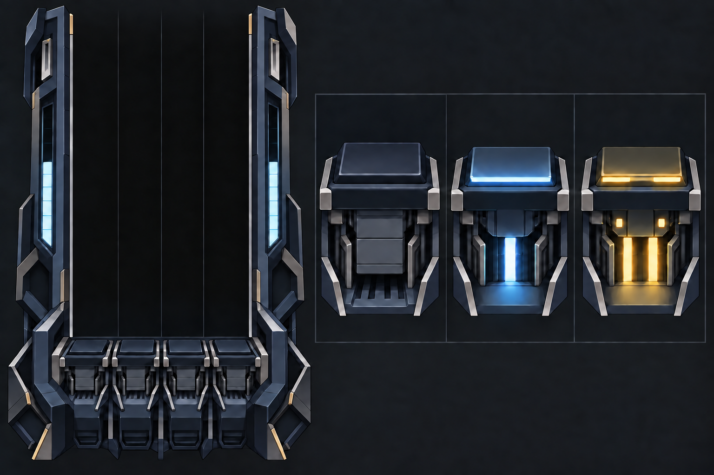

# 노트 에셋 Lab

2026-09-14. 확정된 포인트 노트, 롱노트 바디, 터미널, 키봄을 Lab의 **실제 튜토리얼 재생기**에서 시연하는 작업 공간이다.

구현 경로는 `/lab/note-assets`이며 공통 Lab 카탈로그의 `Rendering` 분류에서 연다. 앱에서는 `import.meta.env.DEV` 라우트 아래에서 로드하고, 별도 공개 Lab 빌드에서도 제공한다. SVG 시연 자료는 `public/lab/note-assets/`에 두며 메인 앱 프로덕션 빌드에서는 기존 `excludeLabFromBuildPlugin`이 `dist/lab` 전체를 제거한다. Classic 런타임 PNG는 `public/skins/classic/`에서 Lab과 실제 플레이가 함께 읽으며 프로덕션 빌드에도 포함한다. Lab SVG와 런타임 PNG의 URL은 배포 base에 맞춰 계산한다. 게임의 `Settings → Skin → Classic`에서 선택하고 저장할 수 있다. 기본 스킨은 Crystal이다.

공통 `/lab` 목록에서 **노트 에셋 시연실**을 누르면 Classic 시안으로 들어간다. 시연실 상단의 **← Lab 목록**으로 돌아올 수 있다. 목록은 다른 Lab 테스트 페이지도 함께 안내하며, 휴대폰에서도 사용할 수 있다.

## 추진부 아이디어 확정

2026-09-29 사용자는 9월 16일 시안을 다시 비교한 뒤 **입력하면 추진부가 활성화되어 빛이 분출되는 아이디어**를 확정했다. 후속 버튼·프레임 탐색은 이 아이디어에서 출발한다.

같은 날 후속 피드백으로 **각 버튼의 분출구를 하나로 고정하고 싱글·더블을 이펙트 색으로만 구분**하기로 확정했다. 싱글과 더블이 빠르게 반복되므로 같은 구멍·같은 활성 형상·같은 한 줄 분출을 유지한 채 연파랑↔금색을 즉시 바꾼다. 구멍·코어·광선 개수를 늘리거나 둘로 나누지 않으며, 셔터 재개방·조리개 이동·빛 합치기와 갈라지기·중간 대기 상태를 전환 조건으로 두지 않는다. 결정 근거는 [RFD 0027](../rfd/0027-single-aperture-thrust-feedback.md)이다.

후속 사용자는 **화면 앞의 사용자를 향해 분출**되기를 요청했다. 직전 단일 분출구 비교의 3번은 방향의 기준이며 원형 구멍과 버튼 디자인을 채택한 것은 아니다. 구멍 하나와 즉시 색 전환을 유지하면서 정면을 향한 출구와 빛을 다른 버튼 외형으로 탐색한다.

아래 이미지는 추진부 아이디어를 설명하는 이전 참고 자료다. 이 이미지의 두 줄 분출과 구멍 구성은 현재 표시 규칙을 대신하지 않는다. 프레임·입력면·외장·단일 분출구의 형상과 재질, 정확한 색감·대기와 활성 사이 모션의 세부 선택은 [PRD §12](../prd.md#12-미정-사항)에서 추적한다. 기존 노트 고유색과 입력·판정 규칙은 각 명세를 따른다. 이 기록은 런타임 에셋 교체나 새로운 비행 규칙 적용을 뜻하지 않는다.

참고 이미지의 원본은 별도 `note-lane-frame` 작업 폴더의 미커밋 파일 `lab/image-galleries/classic-art-direction-20260916/thrust-refined-05.png`다. 같은 파일을 `assets-lab/classic/references/thrust-concept-20260916.png`로 보존했다. 당시의 다른 프레임·버튼·모션 시안도 탐색 이력이며 최종 도안 승인을 뜻하지 않는다.

후속 정지 시안은 `/lab`의 `IMAGE GALLERIES → 추진부 버튼 · 정면 분출`에서 `/lab/images/thrust-button-study-20260929/`로 연다. 낮은 일체형·겹친 장갑형·매립형 광창 3개에서 버튼 한 칸의 기본·싱글·더블 상태를 비교한다. 정지 비교에서는 기본 상태를 같은 구멍에 빛이 꺼진 모습으로 둔다. 원본 확대·PNG 다운로드·번호 이동과 방향 기준인 이전 3번 펼치기, Lab 목록 복귀를 제공한다. 초기 단일 분출구 시안과 더 이전의 셔터·덮개·두 분출구 탐색은 실제 생성 요청과 기록만 `assets-lab/classic/revisions/thrust-button-study-20260929/`에 남기고, 이미지와 보관 페이지는 저장소 용량 때문에 포함하지 않는다. 휴대폰에서는 한 열로 표시하고 첫 시안 이후 이미지는 지연 로드한다.

### 전체 프레임의 키워드 기반 탐색

2026-09-29 사용자는 추진부 외형 선택을 잠시 넘기고 전체 프레임을 탐색하기로 했다. 이전 아제우스 카드 원화에서 형태·구조·재질·배색·빛의 키워드를 추출한다. 후속 생성은 원화와 작품 이름을 직접 입력하지 않고 추출한 텍스트와 기존 게임 배치를 사용한다. 관찰과 적용 제안은 [전체 프레임 키워드](../design/classic-frame-keywords-20260929.md)에 기록한다. 추진부의 확정된 분출 규칙은 유지하며 버튼 외형 3종 중 하나가 선택된 것으로 취급하지 않는다.

최신 전체 프레임 비교는 `/lab`의 `IMAGE GALLERIES → 전체 프레임 · 백색광 버튼`에서 `/lab/images/frame-keywords-six-20260929/`로 연다. 사용자가 임시 시안으로 채택한 `52-restored-frame-v15.svg`를 기준으로, 눌린 둘째 버튼의 넓은 누름면은 밝은 백색광, 번짐과 반사광은 고유색인 연파랑으로 수정한다. 후속 수정안 `53-white-core-frame-v16.svg`는 해당 버튼의 조명 영역만 별도 레이어로 표시하는 독립 SVG다. 초기 B 프레임 `22-free-b-v6.png`의 장갑·게이지와 임시 시안의 다른 버튼·개구부는 픽셀을 보존한다. 수정 전후의 버튼 발광 확대와 전체 프레임을 넓은 화면에서 2열, 휴대폰에서 1열로 비교한다. SVG 원본 확대·다운로드·전후 이동·기준 시안과 보존 영역 펼치기·실제 전달한 요청 펼치기·버튼 누름과 게이지 시연 이동·Lab 목록 복귀를 제공한다. SVG는 PNG를 내장한 조립물이다. 이는 디자인 미리보기이며 실제 게임 에셋이나 동작을 바꾸지 않는다.

같은 갤러리의 `press-animation.html`은 버튼 누름 애니메이션과 게이지 채움 시연이다. 비교 페이지의 위·아래 탐색에서 `버튼 누름과 게이지`로 열고 `버튼 발광 전후 비교`로 돌아온다. 페이지가 `53-white-core-frame-v16.svg`와 1번 키 눌림 생성 이미지 `key1-press-insert-v17.png`의 픽셀을 잘라 레이어를 만든다. 둘째 키의 대기 모습은 셋째 키를 대칭축 x=511.5에서 좌우 반전해 덮는다. 셋째 키의 눌림은 v16의 둘째 키를, 넷째 키의 눌림은 생성한 1번 키를 반전한다. 생성 이미지에서는 1번 키 둘레만 쓰며 프레임은 v16 픽셀을 유지한다. 이웃한 두 키의 빛 영역은 키 사이 틈 안에서 서로 흐려지며 교차한다. 두 레이어 영역 밖의 대기 화면은 v16 픽셀과 같다. 모두 대기 중일 때는 v16에 그려진 가운데 틈의 연파랑 번짐을 채도·밝기 보정으로 지운다. 이 보정은 끄고 비교할 수 있다. `D`·`F`·`J`·`K` 키나 버튼 누름으로 1–4번 키를 입력받는다. 누를 때 색은 기본 싱글 연파랑이며 `Shift`를 함께 누르면 반대 색이다. 기본 색은 더블 금색으로 바꿀 수 있다. 누를 때마다 색이 즉시 정해지고 떼는 동안의 잔광도 그 색을 유지한다. 누르는 동안에는 지연 없이 v16의 눌림·발광을 보인다. 더블 금색은 v16 눌림 픽셀이 대기보다 더 띠는 색 성분만 같은 밝기의 금색으로 바꾼 계산 결과이며, 흰 중심과 무채색 픽셀은 싱글과 같다. 떼면 키 몸체는 키 복귀 시간(기본 40ms), 백색광과 주변광은 잔광 시간(기본 150ms)으로 대기 모습에 돌아온다. 기본값에서 백색광은 잔광 시간의 35% 안에 먼저 빠지고, 빛의 증가분에 고유색을 곱한 잔광이 끝까지 꺼진다. 이 방식은 끄고 단순 교차 전환과 비교할 수 있다. 버튼부 확대·전체 프레임 보기, 10배 느리게, 자동 시연, 기본값 복원을 제공한다. 같은 키에 키보드와 포인터 입력이 겹치면 모두 떼야 풀린다. 생성한 1번 키는 윗변 높이가 대기와 같고 누름면이 조금 좁아지는 정도로 눌려, 약 6px 내려가는 2·3번 키보다 눌림이 약하게 보인다. 양옆 게이지는 채움 0~100% 슬라이더와 자동 변화로 조절한다. 빈 게이지 레이어는 위에서부터 채움 경계까지 덮는다. 빈 유리는 기본으로 두 유리관만 빈 남색 유리로 바꾼 생성 이미지 `gauge-empty-insert-v18.png`를 쓴다. 비교용으로 게임의 기어 기둥 게이지와 같은 발광 픽셀 판별로 v16 유리관의 빛을 남색으로 바꾼 계산 결과를 켤 수 있다. 빈 게이지 레이어는 측정한 유리 안쪽 윤곽(곧은 옆벽과 금속 마개 테두리를 따라가는 타원 끝)으로 잘라, 게이지를 비워도 윤곽 밖 픽셀은 바뀌지 않는다. 경계는 8px에 걸쳐 부드럽게 이어지며 값이 바뀌면 300ms 동안 움직인다. 100%는 v16 그대로다. 게이지를 조절하면 전체 프레임 보기로 바뀐다.

최초 6종부터 원본 프레임 복원까지의 이전 탐색(v1–v15)은 실제 생성 요청과 기록만 `assets-lab/classic/revisions/frame-keywords-six-20260929/`에 남기고, 이미지와 보관 페이지는 저장소 용량 때문에 포함하지 않는다. 갤러리에는 현재 비교와 시연이 쓰는 `52-restored-frame-v15.svg`, `53-white-core-frame-v16.svg`, `key1-press-insert-v17.png`, `gauge-empty-insert-v18.png`와, v15 조립 스크립트의 바탕이자 프레임 보존 E2E의 기준인 `22-free-b-v6.png`만 둔다. 첫 수정 전 확대는 즉시 로드하며 수정안과 전체 프레임 이미지는 지연 로드한다. 최종 외형 선택은 [PRD §12](../prd.md#12-미정-사항)에서 관리한다.

## 튜토리얼 재생기

- `NoteAssetPreviewPlayer`에 시안 묶음을 주입하고 내부에서 `TutorialPreviewPlayer`와 `GameRenderer`를 그대로 사용한다.
- `Classic`은 현재 적용본 `v014`(흰빛 포인트·세로 트렌치 바디·포인트 접촉 그림자·반투명 사각 기둥 트릴 켜짐 바디·에디터 회색 마름모 트릴 끝 터미널), 흰 석영 트릴 포인트·대기·실패 바디, 공통 실버 봄이다. 기존 단색 `Classic` 스킨의 ID와 이름은 `simple` / `Simple`로 변경했다.
- `/lab/note-assets?design=classic` 또는 `?design=simple`로 직접 열 수 있다. 미지정·잘못된 ID는 Classic을 선택한다. 시안을 바꾸면 선택 중인 차트를 유지한 채 재생을 처음부터 시작하고, 노트·바디·터미널·봄·에셋 랙을 함께 교체한다.
- Classic의 ‘버전’ 선택기에서 현재 적용본·`v014`·`v013`·`v012`·`v002`·`v001`을 고른다. `v014`는 현재 적용본과 같은 보관본으로, 포인트가 바디 위에 오는 머리·중간 head·바디 끝 Point의 가독성을 다듬었다. 싱글 푸른 흰색·더블 크림색 흰색 포인트 면, imagegen으로 생성한 세로 트렌치 바디, 싱글·더블 포인트 위아래 5px 접촉 그림자, 트릴 포인트 마름모 테두리를 따라 5px 안에서 옅어지는 접촉 그림자, 반투명 사각 기둥이 안에서 빛나는 트릴 켜짐 바디, 에디터와 같은 납작한 회색(#888888) 마름모 트릴 끝 터미널(대기·켜짐·실패 공통)을 쓴다. 싱글·더블 포인트 경계에 맞닿은 바디 2px 띠와의 대비는 대기·켜짐 8개 조합 모두 3:1 이상이고, 연결 트릴(트릴 롱 위 트릴 포인트)의 경계 대비 하위 5%는 대기·홀드 모두 3:1 이상이다. `v013`은 트릴 켜짐 바디가 이전 석영(가운데 흰빛)인 버전, `v012`는 트릴 접촉 그림자가 없는 후보, `v002`는 고채도 포인트·아주 밝은 바디다. 싱글·더블 켜짐 디자인은 기존 켜짐 효과(트렌치 바디에 중앙 흰빛·주변광, 더블 부분 충족은 중앙 흰빛만)로 확정했다(2026-10-01). 켜짐·꺼짐 디자인은 롱노트 바디·터미널에만 두며 포인트에는 두지 않는다. 에디터 타임라인은 스킨과 별개로 트릴 끝 마름모를 직접 그리므로 스킨 버전에 따라 바뀌지 않는다. 중간 탐색 후보 v003~v011의 결정은 [버전 보관 가이드](../../assets-lab/classic/versions/README.md)의 탐색 기록에 있다. 보관 버전은 당시의 테마 설정, 노트·바디·터미널·기어·버튼·16프레임 봄을 사용한다. 현재 적용본은 기존 CSS 키봄 6종 비교를 제공한다. 버전 선택은 Lab에만 적용하며 게임 스킨 설정이나 현재 에셋 파일을 변경하지 않는다.
- `/lab/note-assets?design=classic&version=v001`처럼 선택 버전을 URL에 기록한다. 직접 링크·새로고침·뒤로가기로 같은 버전을 열 수 있다. 화면이 바뀌지 않는 재선택(이미 표시 중인 시안·버전, 잘못된 시안·버전 인자의 정규화 포함)은 주소만 바꾸고 방문 기록을 추가하지 않는다. 보관 버전을 보던 중 Classic을 누르면 현재 적용본으로 바뀌므로 기록을 남긴다. 버전 전환 시 선택한 차트는 유지하고 재생을 처음부터 시작한다. 알 수 없는 버전은 현재 적용본으로 표시하며, Simple로 전환하면 버전 인자를 제거한다.
- `src/lab/noteAssetDesigns.ts`가 시안 목록을 관리한다. 새 시안은 스킨 매니페스트를 등록하고 `createNoteAssetDesign` 설정만 추가한다. 플레이어와 차트, 에셋 랙은 시안별 분기를 추가하지 않는다.
- 포인트 노트는 싱글·더블·트릴·Grace, 롱노트는 기본·트릴 롱·독립·길이 0·Grace·길이 0 Grace와 판정 놓침·중간 해제 차트를 선택한다. 트릴 롱은 기존 튜토리얼의 `connected-trill-long` 차트를 사용한다.
- 차트를 바꾸거나 `처음부터 재생`을 누르면 플레이어 인스턴스를 새로 시작한다.
- `처음부터 재생` 옆의 `일시정지`를 누르면 판정 진행과 렌더를 멈추고 마지막 장면을 유지한다. 버튼은 `재생`으로 바뀌고, 다시 누르면 멈춘 지점부터 이어서 재생한다. 차트·시안·버전을 바꾸거나 `처음부터 재생`을 누르면 재생 상태로 돌아간다.
- 키보드 표시, 판정선, 노트 이동, 입력 표시, 롱노트 상태 변화는 튜토리얼 재생기의 기존 동작을 따른다.

## Supabase 곡으로 연주

개발 서버의 `/game`에서 곡 선택 화면을 열고 **Settings → Skin → 개발용 스킨**을 고른 뒤, 설정을 닫고 Supabase에 등록된 곡·난이도의 **Play**를 누른다. 보관 버전은 Lab과 동일한 매니페스트를 사용한다. 버전 유지·게임 설정 복귀·배포 제외 규칙은 [게임 코어의 개발 환경 스킨 비교](game-core.md#개발-환경의-스킨-버전-비교)를 따른다.

## Classic 스킨 매핑

- 하강 중인 싱글·더블 대기 바디는 imagegen으로 생성한 세로 트렌치 타일을 원본 색 그대로 쓴다. 싱글은 파랑, 더블은 금색이다. 가로선 위주 무늬는 포인트와 겹쳐 보여 쓰지 않는다.
- 입력을 시작해 홀드가 활성화되면 같은 타일에 중앙 흰빛과 주변 빛을 더한 Held 에셋으로 바꾼다.
- 싱글·더블의 켜짐 표시는 후속 연결 바디·터미널까지 이어지며, 더블은 유지 중인 unit 수만큼만 켠다. 트릴은 각 구간의 실제 유지 상태만 표시하고 연결 켜짐을 보내거나 이어받지 않는다. 실패한 구간을 건너뛰지 않고 판정 상태를 미리 활성화하지 않는다. 겹치는 포인트는 바디와 시작·끝 터미널 위에 표시한다. [공통 표시 규칙](game-core.md#포인트-겹침과-연결-바디의-켜짐-표시)을 따른다.
- 판정 윈도우를 지나치거나 중간에 입력을 떼면 같은 타일의 무채색·45% 밝기 Failed 에셋으로 바꾼다.
- 싱글·더블 터미널은 같은 상태의 바디와 동일한 타일을 쓴다. 대기·홀드·실패 때 바디와 터미널이 함께 전환된다.
- double의 부분 상태는 방향 구분 없이 같은 밝은 타일에 중앙 흰빛만 켠 에셋을 쓴다. 완전 충족 시에만 주변 빛을 더한다.
- 싱글·더블 터미널 원본은 바디와 같은 100:20 타일이며 외곽 돌출이 없다. 플레이에서는 포인트 폭을 기준으로 바디와 터미널의 폭을 함께 줄인다. 상하로 반복되는 같은 타일을 시작·끝에 사용하므로 상하반전해도 동일하다. 바디를 터미널 아래까지 채워 접합부가 비지 않도록 한다. 시작 터미널은 시작 시각까지만, 끝 터미널은 끝 시각까지만 표시하고 판정선에 닿을 때 전체 높이를 판정선 위에 고정한다. 두 터미널이 겹칠 만큼 짧으면 시작 전에는 시작 파츠만, 시작 후에는 끝 파츠만 표시한다. 길이 0 롱노트는 시작 터미널 하나만 표시한다.
- 트릴 포인트·바디는 [6번 석영 SVG](trill-quartz-svg-preview.md)의 밝은 흰 포인트·회색 음영 바디를 사용한다. 끝 터미널은 에디터가 트릴 롱 끝에 그리는 것과 같은 납작한 회색(#888888) 마름모 원본 하나(`terminal-end-trill-editor.svg`)를 대기·켜짐·실패에 공통으로 쓴다. 각각200×40 PNG로 내보내100×20으로 표시한다. 세 파츠의 최대 너비가 같으며 싱글·더블의 포인트 돌출을 적용하지 않는다. 바디는 두 마름모의 좌우 꼭짓점 사이를 채우고 시작 캡은 그리지 않는다.
- 트릴 바디는 상태별 원본을 사용한다. 대기는 기존 회색 석영, 홀드가 활성화되면 반투명 사각 기둥이 안에서 빛나는 imagegen 타일(`body-trill-on-frosted.svg`, 켜진 구간 평균 휘도 대기 대비 +0.153), 실패하면 빛이 없고 어두운 무채색 석영이다. 석영 켜짐 바디·끝 터미널 원본(`body-trill-on.svg`, `terminal-end-trill*.svg`)은 석영 미리보기 생성기가 다시 쓰는 파일이라 Classic 빌드 입력에서 뺀다. 별도 트릴 Grace 도안은 추가하지 않는다.
- 싱글·더블 포인트는 흰 레일 안쪽 검은 세로띠·바깥 외곽선이 없는 흰빛 중앙 면 원본을 사용한다. 원본은 접합 폭100 / 전체 폭106이며 재생기 텍스처는 포인트212×40, 바디·터미널200×40 PNG다. 실제 플레이와 Lab에서는 포인트 이미지 전체를100px 레인 안에 맞춘다. 바디 이미지 폭이 포인트 이미지보다 좁으면 그 비율(Classic 200/212)만큼 바디·터미널·그림자를 줄여 가운데에 두므로 Classic 싱글·더블은 약94.34px, 양쪽 여백 약2.83px다. 기준은 노트 종류가 아니라 에셋 폭이다. 트릴·Simple·Crystal처럼 포인트와 바디 이미지 폭이 같으면 레인 폭 그대로 그린다. 별도 스킨 설정은 없으며 포인트와 바디를 같은 배율로 내보내면 된다. 포인트·터미널 높이는20px를 유지하고 바디 타일은 원본 비율대로 약94.34×18.87px 주기로 반복한다. 이 배치 규칙은 모든 Classic 보관본에 공통 적용한다.
- 바디는 `TilingSprite`로20px 주기를 반복하고 남는 부분을 자른다. 롱노트 길이에 맞춰 반사광을 세로로 늘리지 않는다. 다른 스킨은 기존 stretch 표시를 유지한다.
- 현재 Classic은 싱글·더블 포인트 위아래 5px에 바디 폭 접촉 그림자(농도40%→0)를, 트릴 포인트에는 마름모 네 변을 따라 5px 안에서 옅어지는 접촉 그림자(테두리 농도70%, 불투명한 포인트 가장자리 1px 안쪽까지)를 깐다. 포인트 원본은 덮지 않는다.
- 접촉 그림자 에셋이 없는 보관본(v001·v002 전체, v012의 트릴)은 기존 `pointShadow`를 쓴다. 싱글·더블 포인트 아래에는 바디와 같은 약94.34px 폭의 그림자(상단19.6px, 높이3.2px, 시작 알파48%)를 표시한다. 트릴은 같은 그림자 텍스처를 마름모의 아래 두 변에 맞추되, 농도를75%(최대 알파36%)로 낮추고 퍼지는 높이를6.4px로 늘린다.
- Grace는 본체를 줄이지 않고 사방12px 여백의 별도 overlay로 표시한다. 검정1px→흰색1px 보더와 바깥10px 동안 흰색 알파80%→0%를 유지한다. 길이0 `holdOnly`도 시작 터미널 하나에 같은 overlay를 표시하며, 바디 실패 후에는 숨긴다.
- 기존 `note-asset-lab` 스킨은 이전 비교용 에셋을 보존한다. Classic과 Simple 모두 Lab에서 시연하며, 인게임 선택지와 기본 게임 스킨은 Classic이다. Crystal은 완성도가 낮아 개발 중으로 돌려 인게임 선택지에서 숨겼다.

## 키봄

Classic은 튜토리얼 판정 콜백으로 선택한 CSS 키봄을 실제 레인의 판정선에 표시한다. 플레이어가 캔버스와 키보드 높이로 계산한 정규화 좌표를 전달하므로 화면 크기나 키보드 표시 높이가 바뀌어도 위치가 맞는다. 레인별 효과를 독립적으로 유지해 동시 판정에서도 서로 덮어쓰지 않는다. 6종은 에셋 랙에서도1.5초 간격과 개별 클릭으로 다시 재생한다. 기본 실버 링은280ms의16프레임 투명 PNG로도 스킨에 포함해 Pixi에서 사용할 수 있다. 싱글·더블은 공통 봄을 쓴다.

Simple은 기존16프레임 봄을 Pixi에서 재생한다. 랙에도 같은 프레임을 표시하며, 시안 변경 시 이전 시안의 CSS 봄과 타이머를 정리한다. 동작 줄이기 설정에서는 랙에 정지 장면을 표시한다.

## 에셋 랙

Classic은 트릴을 포함한 포인트3개, 바디 상태10개, 터미널 상태11개, 공통 키봄6개를 표시한다. 트릴은 대기·켜짐·실패를 표시하며 별도 Grace 도안은 나열하지 않는다. Simple도 세 종류의 상태 키에 해당하는 런타임 PNG와 기본 봄을 표시하고, 별도 Grace 소스가 없는 터미널은 대기·켜짐·실패만 나열한다.

## 제작 및 교체

- Classic 선택 원본과 출처는 `assets-lab/classic/revisions/body-six-20260929/selected/`에 보존한다. `sources/point-{single,double}.svg`는 기존 고채도 원본이며, `sources/body-{single,double}-bright.svg`는 선택한 200×40 PNG를 내장한 1000×200 SVG다. `CLASSIC_SOURCE_NAMES`는 이 4개와 석영 트릴 원본을 읽는다. 이전 Penpot 바디·독립 터미널은 제작 이력으로 보존한다.
- `bright-body.mjs`는 선택 타일에 대기·홀드·부분충족·실패 표시를 적용한다. `states.mjs`는 각 상태의 바디와 시작·끝 터미널을 동일하게 출력한다. 모든 색면과 상태 효과는 세로로 일정해 상하 반복된다.
- `pnpm build:classic`: SVG 시연 자료는 `public/lab/note-assets/classic/`, 런타임 PNG와16프레임 실버 봄·버튼은 `public/skins/classic/`에 생성한다. 같은 시안의 디자인을 수정할 때는 소스를 바꾼 뒤 이 명령만 실행하면 Lab과 인게임에 함께 반영된다. 런타임 PNG는 저장소에 보관하므로 일반 `pnpm build`에 별도 에셋 생성 단계는 필요하지 않다.
- `src/lab/classicSkinVersions.ts`는 보관 버전의 스킨 매니페스트를 고정해 등록한다. `scripts/classicVersionPreviews.ts`는 보관본 해시를 검증한 뒤 PNG·Lab SVG·기어 이미지만 `/lab/skin-versions/classic/<version>/`에 제공한다. 개발 서버와 공개 Lab이 같은 주소 구조를 사용하며 원본·생성 코드는 내보내지 않는다. 일반 게임 빌드에는 이전 버전 이미지를 포함하지 않는다. 저장·검증·복원 명령은 [Classic 버전 보관 가이드](../../assets-lab/classic/versions/README.md)를 따른다.
- `CLASSIC_SOURCE_NAMES`에 석영 `point-trill`, `body-trill`, `terminal-end-trill`과 바디·끝 터미널의 `-on`·`-failed` 원본까지7개를 포함한다. 이 원본을 재구성하려면 먼저 `node scripts/build-trill-quartz.ts`를 실행한다. Classic 빌드는 저장된 SVG 원본을 읽어 트릴8개 런타임 상태 키에 연결하며, 싱글 대체 텍스처를 사용하지 않는다.
- `/assets-lab/classic/terminal-preview.html`은 현재 선택 타일의 싱글·더블 시작/끝 조립, 100px 실제 크기, 길이 0과 PNG가 내장된 독립 SVG 4개 다운로드를 제공한다. 이전 벡터 터미널 제작 이력은 `assets-lab/classic/README.md`를 따른다.
- `node scripts/build-skins.ts --skin=simple`: 이름을 옮긴 기존 `assets-lab/simple/`에서 Simple PNG를 생성한다. 다른 스킨의 에셋을 다시 생성하지 않는다.
- Simple은 켜짐 효과가 없는 스킨이다(테마 `heldEffect: false`, [RFD 0028](../rfd/0028-skin-held-effect.md)). `assets-lab/simple/components.jsx`의 `HELD_EFFECT = false`에 따라 `assets-lab/export.jsx`가 켜짐 요소를 그리지 않으므로 켜짐 PNG를 만들지 않는다. 유지 중에도 대기 바디·터미널을 그리고, 더블 부분 실패와 실패는 표시한다. 시연실 랙에는 켜짐·중앙광 항목이 없다. 두 선언이 어긋나면 `assets-lab/svgSkinHeldEffect.test.ts`가 실패한다.
- Simple 트릴 끝 터미널은 에디터와 같은 납작한 회색 마름모(`#888888`, 실패 `#555555`, 불투명도 70%)다. 싱글·더블 롱노트는 반쪽 캡 스킨에서 터미널 윗부분 절반만 그리지만, 트릴 롱 끝은 스킨 방식과 관계없이 터미널 이미지 전체(100×20)를 그리므로 마름모 전체가 보인다.
- 포인트의 사선 반사는 포함하지 않는다. 현재 승인된 부드러운 유광과 윗면 모서리 반사를 유지한다.
- 스킨이 테마 `pointContactShadow { above, below }`와 에셋 `pointContactShadow`를 함께 선언하면, `GameNoteRenderer`는 싱글·더블 포인트 위아래 바디에 바디 폭 접촉 그림자를 그린다. 텍스처는 윗행이 가장 짙은 세로 그라디언트이며 아래는 그대로, 위는 세로로 뒤집어 포인트 경계에 짙은 행이 닿게 한다. 그림자는 바디 위, 포인트 아래 층에 놓인다. 이 경우 싱글·더블의 기존 `pointShadow`는 그리지 않는다. 트릴은 에셋 `pointContactShadowTrill`이 함께 있을 때 포인트 폭 × (위 + 포인트 높이 + 아래) 영역에 그 텍스처 하나를 포인트 아래 층에 깔고 기존 마름모 하단 그림자는 그리지 않는다. 텍스처는 스킨이 자기 트릴 모양에 맞춰 그린다. 선언하지 않은 스킨은 기존 하단 그림자를 그대로 쓴다. 테마 `pointContactShadow`는 있는데 이미지 `pointContactShadow`가 없거나, 이미지 `pointContactShadow`·`pointContactShadowTrill` 중 하나라도 있는데 테마 설정이 없으면 개발 환경(`pnpm dev`)의 `SkinManager`가 콘솔에 경고한다. 트릴 이미지 `pointContactShadowTrill`만 없는 경우는 의도한 fallback이라 경고하지 않는다.
- 스킨은 테마 `heldEffect`로 롱노트 켜짐 효과 유무를 선언한다(생략 시 효과 있음, [RFD 0028](../rfd/0028-skin-held-effect.md)). 효과가 있는 스킨은 켜짐 에셋 `bodySingleHeld`·`bodyDoubleHeld`·`bodyDoublePartialHeldLeft/Right`·`bodyTrillHeld`가 모두 있어야 하며, 하나라도 없으면 `SkinManager`가 빠진 이름을 담은 오류로 로딩을 멈춘다. `heldEffect: false`인 스킨은 이 에셋을 만들거나 불러오지 않고, 유지 중에도 대기 바디·터미널을 그린다. 부분 실패·실패 에셋은 효과 유무와 관계없이 필요하다. 시연실 에셋 랙은 효과 없는 스킨의 켜짐·중앙광 항목을 보여 주지 않는다. `heldEffect: false`인 스킨이 켜짐 에셋을 선언하면 불러오지 않는 선언이므로 개발 환경(`pnpm dev`)의 `SkinManager`가 콘솔에 경고한다.

검증은 `assets-lab/classic/{states,terminals}.test.ts`, `src/game/screens/songSelect/TutorialPreviewPlayer.test.ts`(일시정지 재개 시점), `src/game/skin/`, `src/game/renderer/{GameNoteRenderer,GameRenderer.noteLayers}.test.ts`, `src/lab/noteAssetDesigns.test.ts`, `src/lab/noteAssetShowcaseSearch.test.ts`, `src/lab/NoteAssetShowcasePage.test.ts`, `scripts/{classic-versions,classicVersionPreviews}.test.ts`, `e2e/lab/{note-assets,classic-terminal-svg,skin-versions}.spec.ts`가 담당한다. 브라우저에서 현재 원본 SVG와 대기 바디·흰빛 포인트의 픽셀 일치, 7개 상태의 바디·시작·끝 타일 일치, 상하 반복과 불투명도를 확인한다. 렌더러 배치로 합성한 v012의 포인트 경계 2px 대비가 대기·켜짐 8개 조합 모두 3:1 이상이고 접촉 그림자가 없는 v002는 미달하는지, v012 바디 원본이 트렌치 타일을 내장하는지, v012 트릴 끝 터미널이 에디터와 같은 색의 불투명 회색 마름모이고 세 상태가 같은지, 실제 게임 경로에서 v012 포인트 위아래에 5px 접촉 그림자를 그리는지, 연결 트릴에서 v013·v014 트릴 포인트 경계 2px 대비 하위 5%가 대기·홀드 모두 3:1 이상이고 트릴 그림자가 없는 v012는 2:1 미만인지, 트릴 3연결에서 마름모 위아래 테두리 그림자가 바디와 포인트를 구분하는지, 현재 게임 PNG가 v014 보관본과 같고 v013과는 트릴 켜짐 바디만 다른지, 실제 Supabase 로딩 경로에서의 포인트 레인 경계·바디 여백도 검증한다. 버전 전환은 차트 유지, 직접 링크·새로고침·뒤로가기, 화면이 바뀌지 않는 시안·버전 재선택 시 방문 기록 미추가, 게임 스킨 설정 보존과 잘못된 버전의 기본값 복귀를 검증한다.
